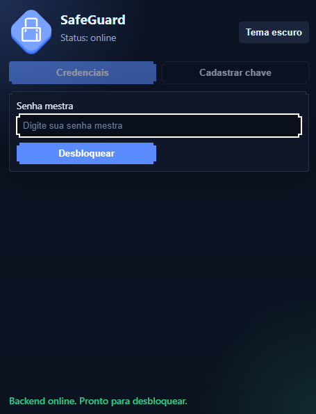
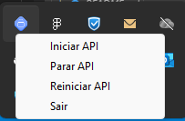

# Safe Guard Browser Extension (MV3)


Extensao de navegador (Chrome/Edge) para integrar com a API local do projeto Safe Guard.

## Objetivo

Fluxo minimo implementado:

1. Usuario informa a senha mestra no popup.
2. Extensao chama `POST /api/v1/unlock`.
3. Extensao lista credenciais via `GET /api/v1/entries/:session_token`.
4. Usuario seleciona uma credencial.
5. Extensao busca a senha via `GET /api/v1/entries/:session_token/:entry_id/password`.
6. Extensao envia autofill para a aba ativa.

### Interface da extensao


## Backend

Este projeto funciona em conjunto com a aplicacao backend Safe Guard:

- **Repositorio**: [safe-guard (Backend)](https://github.com/JSGuilherme/safe-guard)
- **Funcao**: API local que fornece credenciais e gerenciamento de sessoes
- **Endpoint local**: `http://127.0.0.1:5474`

Certifique-se de que o backend esta rodando localmente antes de usar a extensao.



## Estrutura de pastas

- `manifest.json`: configuracao MV3
- `popup.html` e `popup.css`: interface do popup
- `src/background.ts`: orquestracao da sessao e chamadas para API local
- `src/api/client.ts`: cliente HTTP da API local
- `src/content.ts`: logica inicial de autofill em paginas
- `src/popup.ts`: UI e fluxo do popup
- `src/types/*.ts`: contratos locais e mensagens internas
- `scripts/*.mjs`: scripts de build e copia de arquivos estaticos
- `dist/`: artefatos finais para carregar no navegador

## Setup local

### 1. Instalar dependencias

```bash
npm install
```

### 2. Gerar build da extensao

```bash
npm run build
```

### 3. Carregar no Chrome

1. Abrir `chrome://extensions`.
2. Ativar "Modo do desenvolvedor".
3. Clicar em "Carregar sem compactacao".
4. Selecionar a pasta `dist/`.

### 4. Carregar no Edge

1. Abrir `edge://extensions`.
2. Ativar "Modo de desenvolvedor".
3. Clicar em "Carregar sem empacotamento".
4. Selecionar a pasta `dist/`.

## Demo
### Fluxo de uso da extensao

<video width="100%" controls>
  <source src="src/prints/safeGuard.mp4" type="video/mp4">
  Seu navegador não suporta a tag de vídeo.
</video>

A extensao permite desbloquear credenciais com a senha mestra e preenchê-las automaticamente em campos de login.

## Permissoes usadas

- `storage`: manter estado de sessao no escopo da extensao
- `tabs` e `activeTab`: localizar aba ativa para enviar comando de autofill
- `host_permissions`:
  - `http://127.0.0.1:5474/*` para consumir API local
  - `<all_urls>` para permitir content script em paginas web

## Tratamento de erros implementado

- API offline (`API_OFFLINE`)
- Sessao expirada/invalida (`SESSION_EXPIRED`)
- Credencial inexistente (`NOT_FOUND`)
- Resposta invalida da API (`INVALID_RESPONSE`)

O popup exibe mensagens amigaveis para esses cenarios.

## Preparacao para migracao Path Token -> Bearer

O cliente HTTP foi desenhado com estrategia de autenticacao centralizada:

- arquivo `src/config.ts`
- constante `API_AUTH_MODE` com valores possiveis: `"path" | "bearer"`

Atualmente esta em `"path"`, compativel com o contrato atual.
Quando a API migrar para header Authorization, a troca fica isolada no cliente (e no mapeamento de rotas autenticadas).

## Limitacoes atuais

- Autofill heuristico (campos detectados por tipo e metadados comuns)
- Nao preenche em paginas especiais do navegador (`chrome://`, `edge://`, loja de extensoes)
- Sem assinatura de request, whitelist de origem e rate limit (dependem do backend)
- Sessao depende do TTL retornado pela API local

## Seguranca

- Nao ha logs contendo token ou senha em texto claro.
- A senha e requisitada apenas no momento de uso de credencial.
